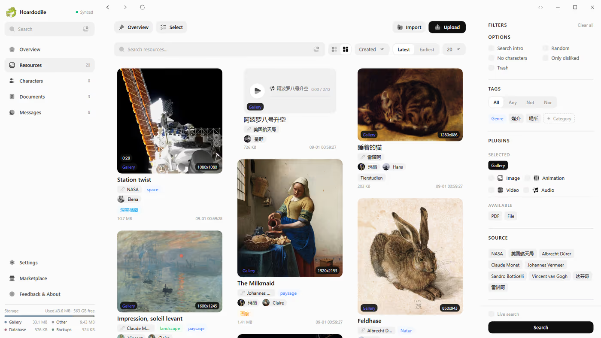

# Hoardodile

<p align="center">
  
</p>

A modern digital hoarding tool. It collects images, documents, video, audio, PDFs and more into **one private library** — browse and preview everything in place, on your own storage.

[中文说明 →](./README.zh-CN.md)

## Features

- **Hoard any content** — extensible content plugins cover images, documents, video, audio, PDFs, comics, novels and archives.
- **Preview in place** — open a resource where it is: a viewer, a reader, a file tree.
- **Plugin marketplace** — install more content plugins from **Settings → Marketplace**, from manga and novel readers to Live2D, Spine and DragonBones skeleton-animation plugins.
- **Desktop or self-hosted** — Windows, macOS, Linux installers, or run it yourself.
- **Private by default** — your data stays on your storage, with no telemetry.

## Get it

**Desktop** — [download the latest release](https://github.com/hoardodile/hoardodile/releases).

## Self-host

Requires **Node 24** and **pnpm**.

```bash
pnpm install
cp .env.example .env
pnpm build
pnpm start    # http://127.0.0.1:3000
```

## Docker

```bash
docker compose up -d
```

## Agent skills

```bash
npx skills add hoardodile/hoardodile@hd-plugin
npx skills add hoardodile/hoardodile@hd-plugin-design
```

## Contributions

Bug reports and feature ideas are welcome via [issues](https://github.com/hoardodile/hoardodile/issues); pull requests are not accepted at this time.

## License

[GPL-3.0](LICENSE)
