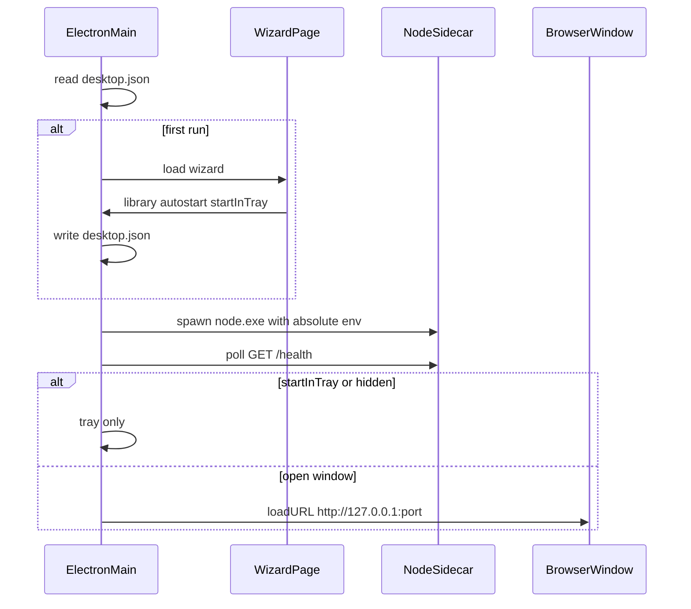

# Hoardodile Desktop

Thin Windows Electron shell around the existing Fastify app. The shell MUST do as little as possible: Fastify, Drizzle, plugins, native addons, and media binaries stay on a real Node 24 sidecar. Electron owns tray, one window, the first-run wizard, env injection, graceful stop, and the updater. UI tokens, palettes, and layout live in `DESIGN.md`.

v1 is Windows x64 only. macOS and Linux are future ports of the same interfaces, not builds.

## Process model



| Process | Owns |
| --- | --- |
| Electron main | Tray, window factory, wizard, updater, env, graceful stop, single-instance lock, `setWindowOpenHandler` |
| Node 24 sidecar | HTTP, tRPC, SQLite, plugins, thumbs, migrations — spawned from `extraResources/node/node.exe`, never `process.execPath` |
| Chromium renderer | Existing SPA (and the wizard page before the sidecar exists); preload is a bridge, not an application layer |

First run runs the wizard (library folder, start with Windows, start in tray) before the sidecar exists. The sidecar is then spawned with a complete absolute env and polled via `GET /health` (`{ ok: true }` — never `/api/health`); the window loads `http://127.0.0.1:<port>/`.

The renderer is disposable: closing the window destroys the `BrowserWindow` (never hides it) and does NOT stop the sidecar, plugin workers, or ffmpeg. Tray Open creates a new window onto the already-listening URL; the Electron session persists under `userData` so reopening does not force a new login. A sidecar crash surfaces in the tray with a restart action and never quits the shell by itself. Quit is tray-only (graceful sidecar stop, then `app.quit()`). A second launch focuses the existing instance; autostart passes a hidden switch so login-item launches don't flash a window when `startInTray` is set.

## Config

`desktop.json` in Electron `userData` (never under `STORAGE_ROOT`): `wizardComplete`, `libraryPath`, `sharedFolderRoot`, `sharedFolderEnabled`, `port`, `lanEnabled`, `autoStart`, `startInTray`, `autoUpdate`. Defaults: `Documents/hoardodile`, `Documents`, off, 3000, off, off, off, on. The wizard collects only library folder, autostart, and start-in-tray — never the admin password or a port.

The shell prefers the persisted `port`, falls back through `get-port`, and writes back the port that actually bound; the port MUST stick across restarts (session cookies are `sameSite: strict`, keyed by host+port). Changing the library relaunches the app (the shell never copies or moves files). Changing the shared folder live-patches the sidecar via `POST /api/internal/shared-folder` (or `{ "path": null }` to disable) without relaunching; the wizard must not turn the switch on.

## Spawn env

With `HOARDODILE_PACKAGED=1` the server skips workspace `.env` loading and the shell injects a complete env, every path absolute: `NODE_ENV=production`, `HOST=127.0.0.1`, `PORT` (persisted, then `get-port`), `STORAGE_ROOT` (libraryPath), `BUILTIN_PATH` (packaged `plugins/file`), `SEED_PLUGIN_PATHS` (gallery), `DISABLE_DEV_PLUGINS=true`, optional `SHARED_FOLDER_ROOT` when enabled, `HOARDODILE_SHUTDOWN_TOKEN` (per-spawn secret), `SESSION_SECURE_COOKIE=false`, `FORCE_HTTPS=false`. `APP_WEB_ROOT` stays unset so the sidecar serves `server/web` from its own dist tree. If Fastify binds a different port than requested, persist it and load it — the `/health` probe on the intended port is enough; don't parse logs.

## Renderer bridge

`contextIsolation`, `sandbox`, `nodeIntegration: false`; folder picks run in main via `dialog`. `window.hoardodileDesktop` exists only in the desktop renderer (wizard and SPA); browser tabs see `undefined`. The bridge exposes `isDesktop`, `platform: "desktop"`, minimize / toggleMaximize / close / isMaximized (+ maximize subscription), `updates` (status, check, progress, `quitAndInstall`), `pickLibraryFolder`, `relaunch`, `setSharedFolderRoot`, `setSharedFolderEnabled`, `setCloseAction`, `openExternal`, `registerAppRoutes`. Caption close follows the persisted close action (`ask` / `tray` / `quit`, editable in Settings; the ask dialog remembers the choice); a caption or taskbar close on the app window routes through the same guard.

## Navigation policy

The app window must never be navigated away from the SPA. The shell's `setWindowOpenHandler` / `will-navigate` policy (`src/main/urls.ts`) keeps a navigation in the window only when it stays on the app origin (loopback `localhost` ⇔ `127.0.0.1` for the same port) **and** its pathname matches one of the SPA's registered route patterns; every other http(s) URL goes to `shell.openExternal` (OS browser) and non-http schemes are dropped. `app` window `window.open` is always denied and re-routed through the same decision. The SPA registers its routes (`fullPath` patterns from `routeTree.gen.ts`) once at boot via `registerAppRoutes` (`desktop:app:routes`), so new routes extend the allowlist automatically and the shell never hard-codes them. Wizard windows keep the historical loopback rule (no links there). Web-side, non-SPA links must go through `ExternalLink` (`apps/web/src/components/common/ExternalLink.tsx`), which calls `openExternal`; the shell policy is the backstop for anything that bypasses it (JS navigation). The policy follows the current frame origin, so a sidecar port change after reload needs no shell state.

## Caption bar

One shared control (prefer `@hoardodile/ui`) used by `AppShell` on the SPA and by the wizard page; details (height `h-nav`, history buttons, Windows caption buttons, drag region, double-click maximize) live in `DESIGN.md`. Shown only when the bridge is present. Accepted gap: no Win11 snap-layout flyout; edge snapping must still work, and the window must not be transparent.

## Packaging

electron-builder, Windows x64, NSIS installer plus optional portable zip (manual GitHub download). The sidecar unit is the whole `apps/server/dist` tree built so the SPA is inside it — never separately stage `apps/web/dist`:

```
extraResources/
  node/node.exe
  server/     apps/server/dist, spawned as `node.exe server/main.js`
  plugins/    file + gallery dist
```

Shell JS may live in asar; nothing the sidecar reads may (server dist, plugin dists). Prune tests, docs, extra Electron locales, PDBs; keep ffmpeg, ffprobe, 7z, sharp, official plugins, and server `.map` files. ffmpeg/ffprobe/7z resolve from the copied `server/node_modules` via `createRequire` — the shell must not inject `FFMPEG_PATH` / `FFPROBE_PATH` / `7Z_BIN_PATH`. `SEED_PLUGIN_PATHS` seeds gallery into `{storage}/versions/<latest>/plugins` when the on-disk tree differs; app updates refresh gallery on the current version only. User data never goes in `extraResources`; DB migrations run against `STORAGE_ROOT` on next start. App version is the root `package.json`; never hand-edit a `version` field.

## Updates

electron-updater against GitHub Releases (`latest.yml` + blockmap). State machine: `idle → checking → downloading → ready → user Restart → graceful sidecar stop → quitAndInstall()`. `autoDownload` follows `autoUpdate`; never restart while a window is using the library without confirmation. Portable builds link to GitHub from About; no `quitAndInstall`. Unsigned self-builds must not require publisher signature verification; signed official releases must verify. Desktop stays click-to-check on web, one brain: preload `desktop.updates` (same GitHub artifacts).

## Shutdown (Windows)

`child.kill()` force-terminates and skips the SIGTERM handler, leaving SQLite WAL locks. The sidecar must expose token-gated `POST /api/internal/shutdown` (loopback only; wrong token → 401, no close). The shell POSTs shutdown, waits for exit, then `child.kill()` on timeout — same sequence for tray Quit and before `quitAndInstall()`.

## Security and privacy

- `HOST=127.0.0.1` by default; local-network binding is an authenticated Settings toggle (same port, `0.0.0.0`) that requires an admin password and is never offered by the wizard.
- `/api/internal/*` control routes are loopback-gated: non-loopback peers get 403 even with a valid token. A browser on the same machine may open the same URL; cookies are not shared with Electron.
- Production desktop never registers `/sw.js` (a SW on `http://127.0.0.1` stale-caches across installer updates) and unregisters any existing controller.
- Folder picker in main, not the renderer; shutdown is token-gated; external https via `openExternal`.

## Dev

`pnpm dev` (browser tab) and `pnpm desktop` (Electron) are independent — `pnpm desktop` never requires `pnpm dev` to be running. Desktop loads the Vite URL so HMR works; when nothing answers there, the shell window shows its own Retry page (caption bar intact) and you can start `pnpm dev` and press Retry inside the window. The desktop never uses the dev Fastify: main registers `session.protocol.handle("http")` to forward SPA-origin `/trpc`, `/auth`, `/api`, `/health` to the sidecar (`dest-api-proxy.ts`); `/api/internal` is never forwarded, and a sidecar restart only updates the target origin. Production windows load the Fastify-served SPA from the sidecar `server/web` tree (no proxy). The wizard has its own small Vite.

`apps/desktop/scripts/dev.mjs` never starts or owns the SPA and does not wait for one. It resolves the SPA URL (ports live in `scripts/lib/dev-ports.json` — change them there, never in consumers) from `HOARDODILE_WEB_URL` or the default, starts the wizard on the first free port at or above its default (bound to `127.0.0.1`), one-shot builds main + preload, and spawns Electron with `HOARDODILE_WEB_URL` / `ELECTRON_WIZARD_URL` / `HOARDODILE_WORKSPACE`; the sidecar is spawned by the shell (vite-node on `apps/server` source), so no backend or plugin watchers from `pnpm dev` are needed, and the SPA's `VITE_SERVER_URL` proxy target is never touched. Ctrl+C closes the wizard server and tree-kills Electron so the sidecar does not linger.

## Future platforms

The same shell / sidecar / renderer split ports: tray becomes a menu bar or status icon, caption buttons follow the OS, notarization and AppImage/deb replace NSIS. Don't encode Windows-only APIs in the preload beyond `platform: "desktop"`.
