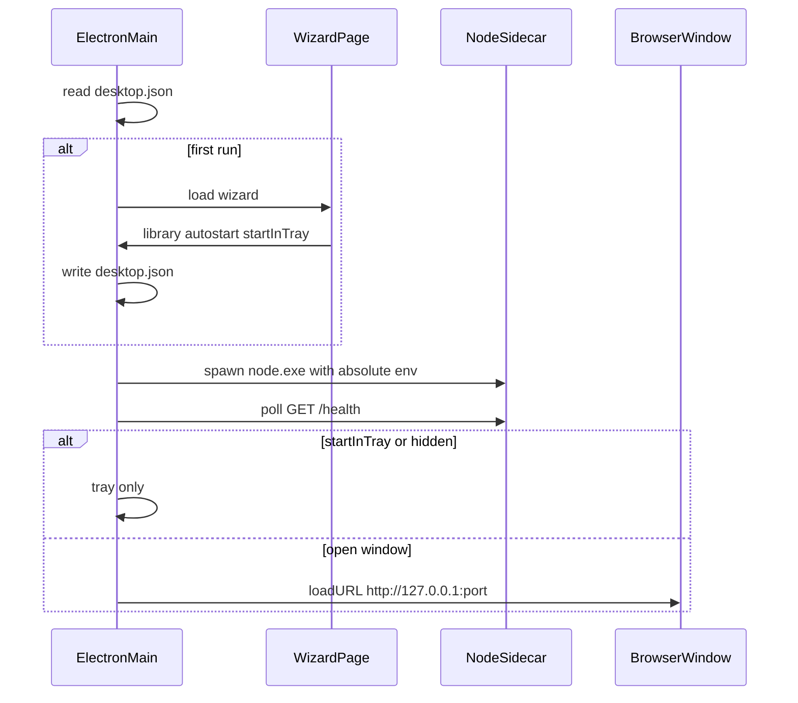

# Hoardodile Desktop

This document is the implementation contract for the Windows desktop distribution. It specifies process boundaries, packaging, updates, and the thin Electron chrome around the existing Fastify app. UI tokens, palettes, and layout remain in `DESIGN.md`; this file only adds the caption strip the frameless window needs.

The shell MUST do as little as possible. Fastify, Drizzle, plugins, native addons, and media binaries stay on a real Node 24 process. Electron owns tray, one window, the first-run wizard, env injection, graceful stop, and the updater.

v1 is Windows x64 only. macOS and Linux are called out as future ports of the same interfaces, not as builds.

## Purpose and non-goals

Desktop is an extra distribution: a tray icon, a frameless window, a first-run wizard, and background updates around the same server that `pnpm start` already runs. It does not replace self-host. NAS, headless, and browser-against-localhost remain supported.

Non-goals for v1:

- Running Fastify inside Electron's Node (`utilityProcess`, `ELECTRON_RUN_AS_NODE`, electron-rebuild of addons)
- Re-bundling `apps/web` or `@hoardodile/server` in the Electron package (the server Vite dist is the sidecar unit)
- Listening on anything other than `127.0.0.1`
- Auto-restart after an update
- Copying or moving a library when the user changes the folder
- macOS / Linux installers
- Perfect Win11 snap-layout flyout on a frameless maximize button

## Process model



Three processes, one job each:

| Process | Owns |
| --- | --- |
| Electron main | Tray, single window factory, wizard, updater, env, graceful stop, single-instance lock, `setWindowOpenHandler` |
| Node 24 sidecar | HTTP, tRPC, SQLite, plugins, thumbs, migrations |
| Chromium renderer | Existing SPA (and the wizard page before the sidecar exists). Preload is a bridge, not an application layer |

The sidecar is a child of `node.exe` shipped in `extraResources`, never `process.execPath`. Native addons keep the Node ABI (`better-sqlite3`, `sharp`, `@node-rs/argon2`) and live under `server/node_modules` inside the server dist. Plugin workers load `chunks/worker-entry.mjs` from that same dist (`resolveWorkerEntryUrl` in `plugins/host/src/sandbox/host.ts`); that file MUST remain a real on-disk ESM entry.

The renderer is disposable. Closing the window MUST destroy the `BrowserWindow` (not hide it). That releases Chromium, the SPA, and sandboxed plugin iframes. It does **not** stop the sidecar, plugin workers, or ffmpeg. Tray Open MUST create a new window onto the already-listening URL. The Electron session MUST persist under `userData` so reopening does not force a new login.

Single-instance: a second launch MUST focus the existing tray and, if the user asked for a window, recreate or focus the one window. Autostart MUST pass a hidden switch so login-item launches do not flash a window when `startInTray` is set.

## Lifecycle

- Caption close, preload `close`, and the window `close` event: destroy the renderer. Sidecar and tray stay.
- Tray Open: one window, `loadURL(http://127.0.0.1:<port>/)` after `/health` has succeeded for this spawn.
- Tray Quit: graceful sidecar stop, then `app.quit()`.
- Sidecar crash: tray MUST surface it and offer restart. The renderer, if any, MUST be destroyed or shown a starting state; it MUST NOT keep talking to a dead port.
- Child crash MUST NOT quit the shell by itself.

`GET /health` in `apps/server/src/server.ts` is the ready probe (`{ ok: true }`). The shell MUST NOT wait on `/api/health`.

## Config

Desktop config lives in Electron `userData` as `desktop.json`. It MUST NOT live under `STORAGE_ROOT` (the wizard has to write it before the sidecar exists).

```json
{
  "wizardComplete": true,
  "libraryPath": "C:\\Users\\…\\Documents\\hoardodile",
  "sharedFolderRoot": "C:\\Users\\…\\Documents",
  "sharedFolderEnabled": false,
  "port": 3000,
  "autoStart": false,
  "startInTray": false,
  "autoUpdate": true
}
```

Default `libraryPath` is `Documents/hoardodile` (`app.getPath("documents")`). Default `sharedFolderRoot` is `Documents`. Default `sharedFolderEnabled` is off — a missing field in an existing `desktop.json` is also off. Default `autoUpdate` is on. Default `autoStart` and `startInTray` are off.

The wizard (first launch only, before spawn) collects:

1. Library folder (system directory picker)
2. Start with Windows
3. Start in tray (no window until tray Open)

It MUST NOT collect the admin password (that remains `/login` in `apps/web/src/routes/login.tsx`) or a port. The shell prefers the persisted `port`, falls back through `get-port` the same way `apps/server/src/config/port.ts` does, and writes back the port that actually bound.

Port MUST stick across restarts. Session cookies are `sameSite: "strict"` and keyed by host+port (`apps/server/src/domain/auth/cookie.ts`). A new port after a restart logs the user out of the Electron session.

Changing the library later: Settings (desktop-only) or tray picks a new folder, then relaunches. The shell MUST NOT copy or move files. An empty directory is a new library (web setup). A directory with `app.sqlite` is that library.

Changing the shared folder later: Settings (desktop-only) stores the path in `desktop.json`. Shared-folder import stays off until the enable switch is on. Turning the switch on live-patches the sidecar via `POST /api/internal/shared-folder` with the current path; turning it off sends `{ "path": null }` and clears `SHARED_FOLDER_ROOT`. Changing the path while enabled live-patches the new path. The app MUST NOT relaunch. The wizard does not ask and MUST NOT turn the switch on.

## Spawn env

When `HOARDODILE_PACKAGED=1`, `apps/server/src/main.ts` MUST NOT call `loadWorkspaceEnvFile()`. The installer tree has no repo `.env` and no `pnpm-workspace.yaml`. `apps/server/src/config/env.ts` MUST NOT resolve relative defaults against a guessed workspace. The shell injects a complete env; every path is absolute.

| Variable | Packaged value |
| --- | --- |
| `NODE_ENV` | `production` |
| `HOST` | `127.0.0.1` |
| `PORT` | persisted port (then `get-port`) |
| `STORAGE_ROOT` | `desktop.json` `libraryPath` |
| `APP_WEB_ROOT` | omit — sidecar serves `server/web` from the dist tree. Set only to override |
| `BUILTIN_PATH` | packaged `plugins/file` dist |
| `SEED_PLUGIN_PATHS` | gallery dist |
| `DISABLE_DEV_PLUGINS` | `true` |
| `SHARED_FOLDER_ROOT` | Only when `desktop.json` `sharedFolderEnabled` is on: `sharedFolderRoot` (default Documents). Settings live-patches via `/api/internal/shared-folder`; disable sends `path: null`. Wizard does not ask. Unset disables folder import on self-host. |
| `HOARDODILE_PACKAGED` | `1` |
| `HOARDODILE_SHUTDOWN_TOKEN` | per-spawn secret |
| `SESSION_SECURE_COOKIE` | `false` |
| `FORCE_HTTPS` | `false` |

The sidecar still uses `resolveAvailablePort`. If Fastify binds a different port than requested, the shell MUST persist that port and load it. Do not parse logs for the URL when `/health` on the intended port is enough; if bind fails, re-pick, persist, retry.

## Preload

Renderer: `contextIsolation`, `sandbox`, `nodeIntegration: false`. Folder picks run in main via `dialog`.

`window.hoardodileDesktop` exists only in the desktop renderer (wizard and SPA). Browser tabs MUST see `undefined`.

The bridge MUST expose:

- `isDesktop: true`
- `platform: "desktop"` (the `ClientPlatform` member already in `packages/schemas/src/platform.ts`)
- `minimize`, `toggleMaximize`, `close`, `isMaximized`, and a subscription for maximize state
- `updates`: status, check, download progress, `quitAndInstall`
- `pickLibraryFolder`, `relaunch`, `setSharedFolderRoot`, `setSharedFolderEnabled`

Caption `close` destroys the window. Quit is tray-only.

`apps/web/src/features/usage/detectPlatform.ts` currently returns `Exclude<ClientPlatform, "desktop">`. When the bridge is present it MUST report `"desktop"` and send `x-platform: desktop` on tRPC (`apps/web/src/trpc/client.ts`).

`setWindowOpenHandler` MUST send non-localhost `http:`/`https:` to `shell.openExternal`. Localhost stays in the app window.

## Caption bar

On the SPA the strip sits at the top of the content column (canvas + panel together), not over the sidebar. It is full-width on login (no sidebar), below the sidebar breakpoint, and on the first-run wizard. `AppShell` owns those placements, including desktop login; the wizard page hosts the same shared control component.

Default app `BrowserWindow` size is 1280×800 (minimum 800×560). Wizard is 520×640 (minimum 440×520).

- Height: `h-nav` (38px in `DESIGN.md`)
- Back, forward, and reload on the left (window history)
- Windows caption buttons on the right
- `-webkit-app-region: drag` on the strip; `no-drag` on buttons, inputs, and links
- Double-click the drag region toggles maximize
- Shown only when `window.hoardodileDesktop` is present

Wizard and SPA MUST share one control component (prefer `@hoardodile/ui`) so the two pages cannot drift. The wizard is a `loadFile` / custom-protocol page that uses that component; it is not a server-less copy of the SPA.

Accepted v1 gap: the Win11 snap-layout flyout on the maximize button may be missing. Dragging the caption to a screen edge MUST still snap. Do not use a transparent window.

## Packaging

electron-builder, Windows x64, NSIS installer plus an optional portable zip. Auto-update is NSIS only; portable is a manual GitHub download.

The sidecar unit is `apps/server/dist` from `pnpm -F @hoardodile/server build` (turbo builds web first so the SPA can be copied in). Desktop MUST copy that folder as one tree. It MUST NOT separately stage `apps/web/dist`, run `pnpm deploy`, or attach a workspace `node_modules` for the sidecar.

That dist already contains:

- bundled `main.js` / `index.js` / `reset-main.js` plus `chunks/` (`@hoardodile/host` is inlined; `worker-entry.mjs` is copied next to the chunks)
- `web/` (SPA; Fastify serves it when `APP_WEB_ROOT` is unset)
- `migrations/` (runtime SQL + `meta/_journal.json`)
- `node_modules/` with this platform's native addons (`better-sqlite3`, `sharp`, `@node-rs/argon2` and their platform packages) and spawned-binary installer packages (`ffmpeg-static`, `@derhuerst/ffprobe-static`, `@hoardodile/7z-bin`)
- sourcemaps next to the JS (`node --enable-source-maps`)

ffmpeg, ffprobe, and 7-Zip come from that `node_modules/` copy via `createRequire`, the same way sharp does. The shell MUST NOT inject `FFMPEG_PATH` / `FFPROBE_PATH` / `7Z_BIN_PATH`; operators may still set those to override.

```
extraResources/
  node/node.exe
  server/                 apps/server/dist (the whole tree → spawn `node.exe server/main.js`)
  plugins/                file + gallery dist
```

No `extraResources/web`. Official plugins remain a separate `plugins/` tree (`BUILTIN_PATH` / `SEED_PLUGIN_PATHS`); they are not inside the server dist.

Shell JS MAY live in asar. Nothing the sidecar `fs.readFile`s MAY live in asar: the server dist (migrations, `.node`, installer binaries under `node_modules/`, `worker-entry.mjs`, web assets, sourcemaps) and plugin dists.

Prune: tests, docs, extra Electron locales, PDBs. Do not strip ffmpeg, ffprobe, 7z, sharp, official plugins, or server `.map` files. Native extra-arch binaries and sqlite `deps/` are already omitted when the server dist is built.

`SEED_PLUGIN_PATHS` copies into `{storage}/versions/<latest>/plugins` when the on-disk tree differs (`plugins/host/src/seed.ts`). App updates refresh gallery on the current version only. Frozen versions keep their copy. User-installed plugins with other ids stay.

User data never goes in `extraResources`. New SQL in a new app version runs through the existing migrator on next sidecar start against `STORAGE_ROOT`.

## Updates

electron-updater, GitHub Releases, `latest.yml` (and blockmap) produced by electron-builder. App version is root `package.json`; never hand-edit a `version` field. Attaching NSIS + `latest.yml` to the release-it GitHub release is a later CI job; this contract only requires that channel.

State machine:

`idle` → (boot delay + 24h interval, if `autoUpdate`) `checking` → `downloading` → `ready` → user Restart → graceful sidecar stop → `quitAndInstall()`.

`autoDownload` follows `autoUpdate`. `autoInstallOnAppQuit` stays false until the user confirms Restart. Never restart while a window is using the library without that confirmation.

Tray badge and the next window's banner both mean "update ready". Portable builds: About links to GitHub; no `quitAndInstall`.

Unsigned self-builds MUST NOT require publisher signature verification. Signed official Releases MUST verify.

Settings → About:

- Browser: existing `checkForUpdate` against the GitHub API (`apps/web/src/features/settings/checkUpdates.ts`)
- Desktop: preload `desktop.updates` only — same GitHub artifacts, one brain

## Shutdown (Windows)

Node `child.kill()` on Windows force-terminates. The SIGTERM handler in `apps/server/src/main.ts` will not run. That leaves SQLite WAL and locks `extraResources/node/node.exe` for the updater.

The sidecar MUST expose `POST /api/internal/shutdown` on the loopback server. The request MUST carry `HOARDODILE_SHUTDOWN_TOKEN` (header or body). On match, Fastify `close()` then exit. Wrong token: 401, no close. The route MUST bind with the rest of the app on `127.0.0.1` only.

The shell: POST shutdown → wait for exit → on timeout `child.kill()`. Same sequence for tray Quit and before `quitAndInstall()`.

## Size

Keep user-visible capability: ffmpeg, ffprobe, 7z, sharp, official content plugins. Compress with packaging hygiene, not feature cuts. No UPX.

Measure later with a script over `extraResources`. Until then, budget by bucket — do not invent a total:

| Bucket | What it is |
| --- | --- |
| Electron | Chromium + shell |
| Node runtime | shipped `node.exe` (duplicate V8; accepted cost of a real Node ABI) |
| ffmpeg + ffprobe | video probe and thumbs |
| 7z | extra archive formats |
| Server dist | `apps/server/dist`: JS + maps + migrations + SPA + sharp/libvips + other natives |
| Plugins | file + gallery dist |

## Security and privacy

- `HOST=127.0.0.1`. The wizard MUST NOT offer a LAN bind. A browser on the same machine MAY open the same URL; cookies are not shared with Electron.
- Folder picker in main, not the renderer.
- Shutdown is token-gated.
- External https via `openExternal`.
- Production desktop MUST NOT register `/sw.js`. `apps/web/src/main.tsx` registers a service worker in `PROD`; a SW on `http://127.0.0.1` will stale-cache across installer updates. Skip registration when the preload bridge is present (and unregister any existing controller).

Today AGENTS.md allows one outbound call: a user click in Settings → About. Desktop, when `autoUpdate` is on, MAY check and download GitHub Release artifacts while the tray is alive. Web stays click-to-check. That exception belongs in AGENTS.md at implementation time; this file does not change AGENTS.md.

## Dev

`pnpm dev` is unchanged for a browser tab: Vite (default 5173) proxies `/trpc`, `/auth`, `/health`, `/api` to that dest Fastify (`apps/web/vite.config.ts`). Desktop dest MUST still load the Vite URL so HMR works, but the Electron window MUST NOT use dest's Fastify. When `HOARDODILE_WEB_URL` and the sidecar are different origins, main registers `session.protocol.handle("http")` and forwards SPA-origin `/trpc`, `/auth`, `/api`, `/health` to the sidecar (`apps/desktop/src/main/dest-api-proxy.ts`). `/api/internal` is not forwarded. Sidecar restart only updates the target origin. Production windows load the Fastify-served SPA from the sidecar `server/web` tree (no proxy). The wizard has its own small Vite.

Future package: `apps/desktop` (`@hoardodile/desktop`).

## Implementation sequence

Out of scope for the document-only round; required so the contract is buildable.

1. **Server** — skip `.env` when `HOARDODILE_PACKAGED=1`; `POST /api/internal/shutdown`; keep `GET /health`.
2. **Web** — caption bar in `AppShell` (content column, not over the sidebar); skip SW when desktop; `detectPlatform` → `desktop`; Settings: change library + relaunch; About uses preload on desktop; shared caption controls + drag region.
3. **Desktop package** — main, preload, wizard, tray, spawn, updater, electron-builder `extraResources` (copy `apps/server/dist` as `server/`; do not re-package web).
4. **DESIGN.md** — 38px caption strip.
5. **AGENTS.md** — desktop auto-update exception (ask first).
6. **CI** — NSIS + `latest.yml` on the GitHub release; optional Authenticode for official builds.

## Future platforms

The same split (shell / sidecar / renderer) ports. Tray becomes menu bar / status icon; caption buttons follow the OS; notarization and AppImage/deb replace NSIS. Do not encode Windows-only APIs in the preload shape beyond `platform: "desktop"`.
