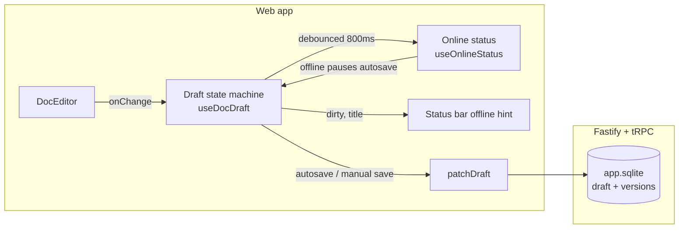

# Documents feature

The knowledge-base module of the web app: a BlockNote-based document editor
with autosave, immutable version history, and a client-side diff view. Draft
saves are unconditional (last writer wins) — there is no offline staging or
conflict resolution.

```
apps/web/src/features/doc/
├── components/         Page pieces (header, editor column, status bar, conflict banner)
├── editor/             BlockNote editor wiring + imperative handle
├── hooks/              Draft state machine, autosave, diff, commit dialogs
├── offline/            Online status signal + error classifiers
├── api.ts              tRPC query/mutation options
├── contentShape.ts     Stored-content format + legacy shape normalization
├── diff.ts             Myers LCS + inline suggestion-mark diff engine
└── lib/                Tree building, prefs, reading anchors
```

## Architecture



Saves carry no concurrency guard, so the last write wins on concurrent
editors. The server still supports `expectedUpdatedAt` as a defensive guard
for API consumers; the web client never sends it.

## Saves and offline behavior

Every dirty edit is debounced and patched to the server unconditionally; a
failed save surfaces through a toast and raises the failure-based offline
flag (`markNetworkOffline`). While offline, autosave is paused so failing
requests do not pile up — edits stay in the editor's pending buffer and are
pushed by the next keystroke or manual save once the connection returns.

The `ConflictBanner` component and its `documents.conflict.*` copy are
retained in the repository but not mounted; the current design has no
conflict state to notify about.

### Online status

Two signals are combined: the browser `online`/`offline` events and a
failure-based flag, raised when a save fails at the transport level. Either
a successful save or an `online` event clears it. While offline, autosave is
skipped and the status bar shows the offline hint.

## Draft state machine

`hooks/useDocDraft.ts` owns the editor-side draft: title input, pending
content buffer, dirty tracking with phantom-change suppression, debounced
autosave, manual save, discard, and the commit gate. Server round-trips go
through `hooks/useDocDraftMutations.ts` (unconditional `patchDraft`, plus
commit/discard).

## Diff view

`hooks/useDocDiff.ts` + `diff.ts` compare the current editor content against
a historical version. The diff is computed with a Myers line-diff followed by
`prosemirror-changeset` and rendered in a read-only twin editor with
BlockNote's `insertion`/`deletion` suggestion marks (which is why
`@blocknote/*` stays pinned to 0.51.x). Legacy empty versions stored as
`{type:"doc",content:[]}` are normalized to empty block lists via
`contentShape.ts`.

## Tests

- `offline/useOnlineStatus.test.tsx` — event + failure signals.
- `offline/errors.test.ts` — the network-error classifier.
- `hooks/useDocDraft.test.tsx`, `hooks/useDocDiff.test.tsx`, `diff.test.ts` —
  draft state machine and diff engine.
