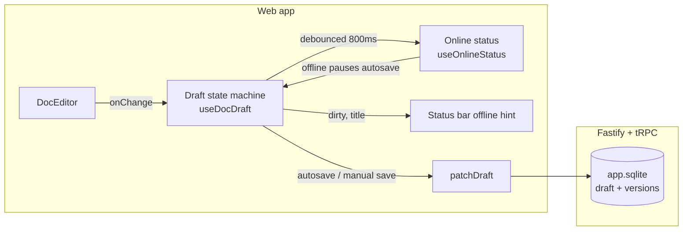

# Documents feature

The knowledge-base module of the web app: a BlockNote-based document editor
with autosave, immutable version history, and a client-side diff view. Draft
saves are unconditional (last writer wins) — there is no offline staging or
conflict resolution.

```
apps/web/src/features/doc/
├── components/         Page pieces (header, editor column, status bar, find bar)
├── editor/             BlockNote editor wiring + imperative handle
│   └── search/         In-document find & replace (locale-agnostic match/replace)
├── hooks/              Draft state machine, autosave, diff, commit dialogs, find
├── offline/            Online status signal + error classifiers
├── api.ts              tRPC query/mutation options
├── contentShape.ts     Stored-content format + legacy shape normalization
├── diff.ts             Myers LCS + inline suggestion-mark diff engine
└── lib/                Tree building, prefs, reading anchors
```

## Architecture



Saves carry no concurrency guard, so the last write wins on concurrent
editors. The server still supports `expectedUpdatedAt` as a defensive guard
for API consumers; the web client never sends it.

## Saves and offline behavior

Every dirty edit is debounced and patched to the server unconditionally; a
failed save surfaces through a toast and raises the failure-based offline
flag (`markNetworkOffline`). While offline, autosave is paused so failing
requests do not pile up — edits stay in the editor's pending buffer and are
pushed by the next keystroke or manual save once the connection returns.

The `ConflictBanner` component and its `documents.conflict.*` copy are
retained in the repository but not mounted; the current design has no
conflict state to notify about.

### Online status

Two signals are combined: the browser `online`/`offline` events and a
failure-based flag, raised when a save fails at the transport level. Either
a successful save or an `online` event clears it. While offline, autosave is
skipped and the status bar shows the offline hint.

## Draft state machine

`hooks/useDocDraft.ts` owns the editor-side draft: title input, pending
content buffer, dirty tracking with phantom-change suppression, debounced
autosave, manual save, discard, and the commit gate. Server round-trips go
through `hooks/useDocDraftMutations.ts` (unconditional `patchDraft`, plus
commit/discard).

## In-document find & replace

`hooks/useDocFind.ts` owns the search state for one document body: the query,
the match list and the active match. Matching (`editor/search/findMatches.ts`)
is a pure scan of the ProseMirror document — literal, per text node, so a
match never spans an inline chip and every range is replaceable in one step.
React stays the single source of truth; the BlockNote extension in
`editor/search/docSearchExtension.ts` only renders the ranges it is handed as
`Decoration.inline` highlights (`.doc-search-match`, `-active` in `doc.css`).

`components/DocFindBar.tsx` is the compact floating widget — VS Code's
in-document find control, pinned to the bottom edge of the editor's sticky
toolbar band (`EditorStaticToolbar`'s `findPanel` slot, so it never needs a
height offset and never collides with the toolbar) — opened by the header
button or `Ctrl/Cmd+F`. The replace row starts collapsed and is expanded by
its chevron or by `Ctrl+H`, which also focuses the replacement field.
Replacing (`editor/search/replaceMatches.ts`) dispatches an ordinary document
transaction per action — one undo step, and the existing draft/autosave
pipeline picks the edit up — with the replaced text keeping the marks of the
text it replaced. Preview, reading and recycle-bin views search without
replacing; diff mode leaves the browser's own find alone.

## Leaving a deleted document

A document that is deleted while it is open must not keep filling the canvas.
`hooks/useDocDeletedExit.ts` reacts to the transition — never to the state — so
an already-trashed document opened from the recycle bin still renders its
read-only preview: a document observed live and then soft-deleted (or answered
as missing) sends the route back to `/documents`. The unsaved-changes guard is
disabled while that exit is in flight. Permanently deleting the open document
from the recycle bin is handled at the source (`DocTrashList`), because the
detail refetch cannot report a missing row as `NOT_FOUND` — the tRPC layer
answers every domain error as `INTERNAL_SERVER_ERROR`, so React Query would
otherwise keep the last payload on screen.

## Diff view

`hooks/useDocDiff.ts` + `diff.ts` compare the current editor content against
a historical version. The diff is computed with a Myers line-diff followed by
`prosemirror-changeset` and rendered in a read-only twin editor with
BlockNote's `insertion`/`deletion` suggestion marks. Legacy empty versions
stored as `{type:"doc",content:[]}` are normalized to empty block lists via
`contentShape.ts`.

### Why `@blocknote/*` is pinned to 0.51.4

The diff engine is built on BlockNote internals that changed after 0.51.x:

- `diffCompute.ts` calls `blockToNode` and reads `editor._tiptapEditor`
  (private API) to get at the ProseMirror schema.
- `@handlewithcare/prosemirror-suggest-changes` (also pinned, 0.1.8) turns
  the computed changes into the same `insertion`/`deletion`/`modification`
  marks that BlockNote's default schema registers — this is what the
  read-only diff editor renders (`doc.css` styles `.ProseMirror ins/del`).
- `prosemirror-changeset` (also pinned, 2.4.1) is the diff engine: the
  whole document is fed to it as one replacement and it splits the changed
  region into individually replaceable steps. **2.4.2 added a 2500-token
  guard in `computeDiff` that returns a large changed range as ONE change**;
  with the whole-document step above, large multi-block edits then produce
  a boundary-crossing replace step that cannot be applied and the diff
  degrades to unmarked (or fallback) content. Upgrade only with the
  large-edit regression test in `diff.test.ts` green.

BlockNote **0.52.0 removed the suggestion marks from core's default
extension set** (verified by inspecting the 0.52.0/0.53.0/0.54.0 tarballs):
the marks now only exist when the extension that provides them is loaded
(the Yjs/AI layer), their attributes and DOM changed, and the schema of a
plain (non-collaborative, non-AI) editor no longer knows them. The diff
transaction would produce marks the schema rejects, so the feature breaks.
0.51.4 is the last 0.51.x release, so the pin cannot move within the minor.

`scripts/guard-protected-deps.mjs` enforces every protected pin from
`pnpm-lock.yaml` at pre-commit and CI time, and `scripts/update-deps.mjs`
(the `deps:update` entry point) never touches protected packages. There is
no `--allow` bypass: an intentional upgrade is a code change.

#### Upgrade checklist (when you actually want to bump)

1. Adapt the diff machinery first: `blockToNode` signature, `_tiptapEditor`
   shape, and the suggestion marks (names, attributes, DOM hookup in
   `doc.css`) against the target release; register custom marks yourself if
   the new API permits, or port the diff to BlockNote's own
   suggestion/AI-diff pipeline (the eventual migration path).
2. Update the exact pins in `apps/web/package.json` and the `PINNED` /
   allowed-version tables in `scripts/guard-protected-deps.mjs` in the same
   change.
3. Run `pnpm -F @hoardodile/web exec vitest run src/features/doc` (diff +
   draft + hooks tests) and build; then manually open a document diff view.
4. Mention the BlockNote bump in the commit message; the protected-deps
   guard now permits the new versions.

## Tests

- `offline/useOnlineStatus.test.tsx` — event + failure signals.
- `offline/errors.test.ts` — the network-error classifier.
- `hooks/useDocDraft.test.tsx`, `hooks/useDocDiff.test.tsx`, `diff.test.ts` —
  draft state machine and diff engine.
